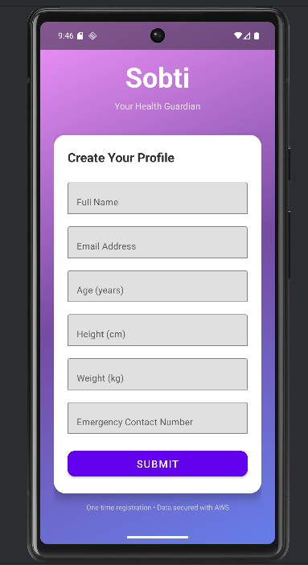
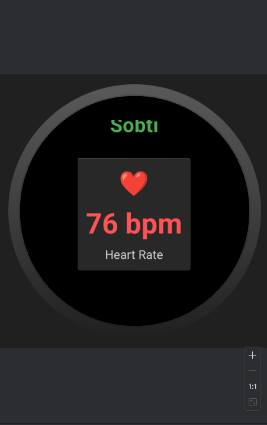

# Sobti - Your Health Guardian

Sobti is a smart health and safety companion designed for **women** and **elderly people**.  
It helps monitor vital health data such as heart rate and aims to support safety and care through wearable technology.

This project includes two parts:  
- An **Android mobile app** for user registration and health data setup  
- A **Wear OS smartwatch app** for real-time monitoring  

**Note:** This project is currently in **development mode**.  
AWS and backend services are **not yet connected**.

---

## Purpose

Sobti is being developed with the goal to:
- Provide **women’s safety features** using wearable-based alerts and monitoring  
- Assist **elderly people** who have memory-related or health conditions  
- Offer continuous **health tracking** and real-time monitoring through smartwatches  

The aim is to combine **health monitoring** with **personal safety** in one connected ecosystem.

---

## Android App (Mobile)

- Allows users to create and manage their personal health profile  
- Collects details such as name, email, age, height, weight, and emergency contact  
- Built with Material Design and gradient UI for a clean experience  
- Future plan: connect with AWS for secure data storage  

**Mobile App Screenshot:**  


---

## Wear OS App

- Displays real-time heart rate using the Wearable Sensors API  
- Simple, round interface optimized for smartwatches  
- Designed for quick health updates at a glance  
- Planned to include SOS alerts and safety notifications  

**Wear OS App Screenshot:**  


---

## Features

- Real-time heart rate monitoring  
- Profile setup with emergency contact information  
- Easy-to-use interface for all age groups  
- Planned safety and SOS features for women and elderly users  
- AWS cloud integration to be added in future updates  

---

## Tech Stack

| Platform | Technologies Used |
|-----------|------------------|
| Mobile | Kotlin, Android Jetpack, Material Components |
| Wear OS | Kotlin, Google Wearable APIs |
| Backend | AWS (to be added in future) |

---

## Getting Started

1. Clone the repository  
   ```bash
   git clone git@github.com:SumitDJakhal/gardiafit.git
   cd gardiafit
